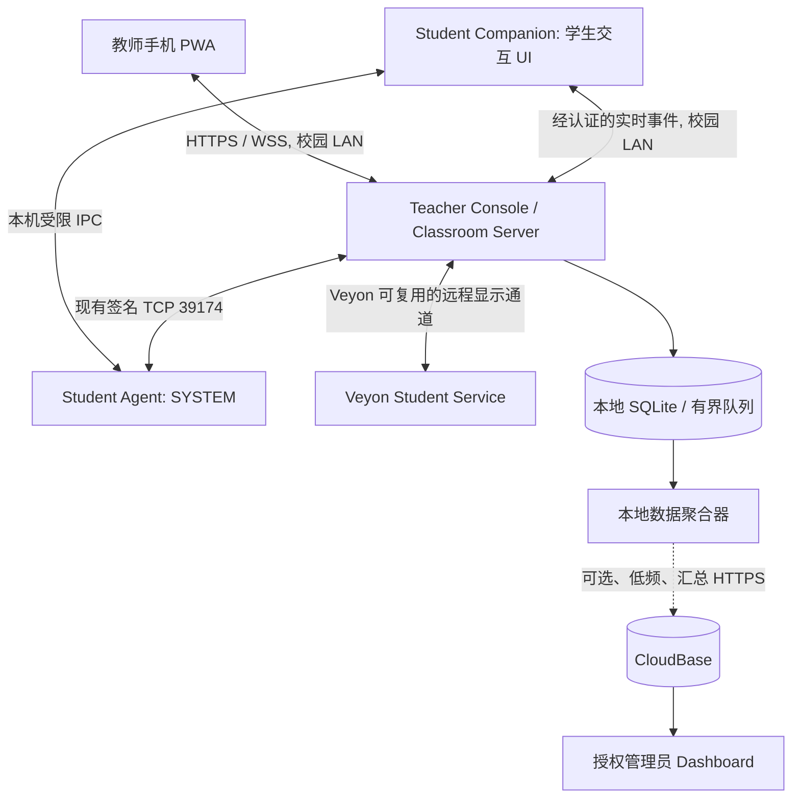

# Veyon Campus — 产品功能与云端数据开发路线图

> **版本**：规划稿 v1.0｜**日期**：2026-10-09  
> **适用分支**：[`develop`](https://github.com/Ljc798/veyon-campus-deployment/tree/develop)  
> **定位**：从「Veyon 部署与设备管控工具」逐步发展为 **Local-first Smart Classroom Platform（本地优先的轻量级智慧课堂平台）**。  
> **本文件是新增功能规划，不替代现有的 [`docs/开发路线与任务清单.md`](https://github.com/Ljc798/veyon-campus-deployment/blob/develop/docs/开发路线与任务清单.md)。** 开发前先与主任务表核对状态。

## 0. 核心决策（先读）

1. **课堂实时交互走校区 LAN**：教师电脑负责本地课堂服务，学生电脑和教师手机在局域网内互通；互联网中断不应影响上课。
2. **CloudBase 只承担跨校区价值**：配置/发行、版本与设备健康、故障汇总、汇总后的课堂使用统计、经授权的模板同步。**不转发聊天、实时屏幕、课堂指令**。
3. **先稳定，再新增**：目前项目进入 Beta 集成与实机验收阶段。先完成 Windows、Android/iOS 与网络环境验证，再开展大规模新功能。
4. **先互动，后视频**：优先做学生举手求助、师生消息和一键课堂模式；手机多屏实时监视先验证性能与 Veyon 复用可行性，再产品化。
5. **复用现有设施**：保留 TCP `39174` 策略签名通道、教师端 Kestrel HTTPS `39176`、已有校区密钥/身份核验与 Veyon 的监视、广播、文件功能；不因引入 WebSocket 而重写已有可靠协议。
6. **权限及数据最小化**：Student Agent 负责系统权限与可信操作；新 Student Companion 负责登录会话中的学生交互；云端默认只存必要的汇总数据。

### 状态说明

- `✅ 已有代码`：develop 中已有实现，**不表示实机验收通过**。
- `🧪 待验收`：需要真实设备/校区网络验证。
- `🆕 待开发`：新需求；不应误判为已上线。
- 优先级 `P0 > P1 > P2 > P3 > P4`。相同优先级内按依赖与建议顺序排列。
- 难度 `1–5` 是相对工程量估计，**不是工期承诺**。

## 1. 当前基线：哪些功能不要重复做

| 现有组件/能力 | 当前状态 | 后续重点 |
|---|---|---|
| Teacher Console、Student Setup、Worker、Student Agent | ✅ 已有代码 | 部署、升级、异常恢复和权限场景的实机回归 |
| Veyon 机房目录与屏幕监视、远程控制等 | ✅ 借助 Veyon | 验证可复用的 CLI/API/协议能力，避免自建重复产品 |
| 网站黑白名单（浏览器级） | ✅ 已有代码 | 浏览器实测、到期/解除、跨版本兼容 |
| AppLocker 应用限制与审核 | ✅ 已有代码 | Windows 版次、学生 SID、实际命中与撤销验收 |
| 六项长期系统策略 | ✅ 已有代码 | 权限、壁纸、用户配置和安全回滚验收 |
| Mobile PWA：配对、设备策略状态、策略启停 | ✅ 已有代码 | Android/iOS 证书信任、局域网及身份核验实测 |
| CloudBase：配置包、版本、校区心跳、匿名设备统计 | ✅ 已有代码 | 先复用数据库和现有 API，再扩展运维指标 |
| 教师/学生签名更新机制 | ✅ 已有代码 | 生产签名发行、安装/回滚、断网场景验收 |
| **手机实时屏幕画面、学生双向消息、在线测验** | 🆕 尚非现有功能 | 按下文阶段推进 |

**版本快照**：读取时仓库 README 提到 App/Worker Beta `0.4.58`、Student Agent `0.4.43`；后续请以实际 `develop` 与主任务表为准。  
参考：[README](https://github.com/Ljc798/veyon-campus-deployment/blob/develop/README.md) · [架构与实施边界](https://github.com/Ljc798/veyon-campus-deployment/blob/develop/docs/veyon_architecture_summary.md) · [手机控制规格](https://github.com/Ljc798/veyon-campus-deployment/blob/develop/specs/mobile-teacher-control/requirements.md) · [数据库表说明](https://github.com/Ljc798/veyon-campus-deployment/blob/develop/docs/CloudBase数据库表用途说明.md)

---

## 2. 总优先级清单

| 顺序 | 优先级 | 功能 / 工作项 | 状态 | 难度 | 价值与理由 |
|---:|:---:|---|:---:|:---:|---|
| 1 | **P0** | Beta 真机验收与稳定性门禁 | 🧪 | 4 | 没有稳定控制链路，新互动功能没有可靠基础 |
| 2 | **P0** | 更新结果/错误码规范与本地诊断 | 🆕 | 2–3 | 多校区维护的基础；故障不靠人工猜测 |
| 3 | **P0** | 本地课堂会话模型（Session / Room / Target） | 🆕 | 3 | 后续互动、统计、课堂模式的共同数据模型 |
| 4 | **P1** | Student Companion 轻量学生界面 | 🆕 | 3 | 学生交互入口，与管理员部署 GUI 解耦 |
| 5 | **P1** | 双向实时消息通道（WSS） | 🆕 | 3 | 举手、消息、测验、通知共同的事件基础设施 |
| 6 | **P1** | 学生举手求助 + 排队 + 教师快捷回复 | 🆕 | 2–3 | 低成本、高频刚需、最明显的教学收益 |
| 7 | **P1** | 教师私聊/全班通知 | 🆕 | 2–3 | 解决求助闭环；广播/打开网址优先复用 Veyon |
| 8 | **P1** | 课堂模式：讲解 / 练习 / 休息 / 下课 | 🆕 | 2–3 | 将已有策略变为教师能直接理解的工作流 |
| 9 | **P1** | 课堂状态/消息的移动端首页 | 🆕 | 2 | 让手机从「策略管理」转向「课堂控制」 |
| 10 | **P1** | 低敏运维云数据 v1（更新/故障汇总） | 🆕 | 2–3 | 最先产生跨校区运维价值 |
| 11 | **P2** | 座位图与机房布局 | 🆕 | 2 | 快速定位求助学生与设备 |
| 12 | **P2** | 一键发网址/教学通知、倒计时 | 部分可复用 | 2 | 很低的学习成本，立刻提升课堂体验 |
| 13 | **P2** | 手机屏幕预览 PoC（3–5 台） | 🆕 | 5 | 先验证 Veyon 数据复用及教师机性能 |
| 14 | **P2** | 手机设备巡视 Overview / Focus / Help | 🆕 | 4–5 | PoC 通过后交付正式监视体验 |
| 15 | **P2** | 课堂即时测验、投票、离堂反馈 | 🆕 | 3 | 从设备管理升级为教学互动 |
| 16 | **P2** | 课堂使用匿名汇总上传 v1 | 🆕 | 3 | 以真实使用率指导产品迭代 |
| 17 | **P3** | 作业分发、收集、教师反馈 | 🆕/可复用 | 3–4 | 面向编程课形成差异化 |
| 18 | **P3** | 学生展示/讲评（受控屏幕共享） | 🆕/可复用 | 3–4 | 展示优秀作品、老师现场点评 |
| 19 | **P3** | 分组任务与课堂进度看板 | 🆕 | 3 | 提升小组教学效率 |
| 20 | **P3** | 教学汇总数据（参与率、提交率等） | 🆕 | 3 | 仅上传充分聚合的数据，非个人画像 |
| 21 | **P4** | 编程自动测试/反馈（独立沙箱） | 🆕 | 5 | 高价值但安全/维护复杂 |
| 22 | **P4** | 云端共享模板、题库、课程计划 | 🆕 | 3–4 | 跨校区标准化；须有租户隔离和权限 |
| 23 | **P4** | 校区趋势分析、故障质量看板 | 🆕 | 3–4 | 先有可信数据，再做可视化 |
| 24 | **P4** | 远程非实时管理能力（可选） | 暂缓 | 5 | 与 Local-first 安全边界冲突，需单独立项 |

> **排序的关键判断**：先交付「学生求助 → 教师手机通知 → 文字指导/现场协助 → 已解决」端到端闭环。屏幕监视虽吸引人，但不是新功能的起跑线。

---

## 3. 分阶段开发计划（含可验收任务）

### P0 — 发布与稳定性基础（新增功能前的门禁）

- [ ] 在可恢复 Windows 10/11 机器上实测 Teacher / Student 安装、重启、卸载、回滚、权限与更新。
- [ ] 完成手机 iOS/Android HTTPS 证书信任、配对、撤销、跨网拒绝、Private/Public 网络、防火墙与 VLAN/AP 隔离测试。
- [ ] 验证网站限制、AppLocker、六项长期策略的真实 Windows 生效与撤销；区分「Agent 已收到」和「最终效果已验证」。
- [ ] 制定统一错误码：`module`、`code`、`version`、`severity`、`retryable`；诊断信息本地优先，提供人工导出。
- [ ] 定义课堂统一标识与会话生命周期：教室、目标电脑、教师会话、开始/结束时间；不直接以学生姓名作为核心 ID。
- [ ] 形成 LAN 压测基线：10、24、60–70 台场景下的教师机 CPU、内存、网络、响应延迟。

**验收标准**：一节课期间断开互联网，教师仍能管理 LAN 内设备；失败目标有清晰错误和恢复操作；关键控制不误报成功。

### P1 — Classroom MVP：真正可用的双向互动

**架构基础**

- [ ] 新增 **Student Companion**：学生登录会话内运行、最小化常驻，提供按钮/通知/答题界面；不得向学生暴露后台 SYSTEM 权限。
- [ ] 将实时课堂事件与底层策略通道分离：Teacher 的 ASP.NET Core/Kestrel 承担课堂消息入口；使用 **WSS**（或先通过长轮询验证），鉴权、授权、限速和消息大小限制必需。
- [ ] 定义事件协议版本：`help.requested`、`help.resolved`、`message.sent`、`class.session.changed`、`notification.broadcast`。
- [ ] 断线重连、去重 ID、消息 ACK、身份固定、校区隔离及过期课堂会话拒绝。

**教师端 / 手机端体验**

- [ ] 学生点击「请求帮助」，选原因（报错/没听懂/完成待检查/其他），可写简短说明。
- [ ] 教师电脑与 PWA 展示待处理队列：设备、求助类型、等待时间、处理状态。
- [ ] 教师快捷回复（「稍等」「先检查错误提示」「我来看看」）和单台私人消息。
- [ ] 教师全班通知；远程打开网址优先研究直接复用 Veyon 已有能力。
- [ ] 「讲解 / 练习 / 休息 / 下课」课堂模式，封装已有网站/应用策略；支持一键按预设切换与逐台执行结果。
- [ ] 手机一级导航调整为 **我的课堂 / 设备巡视 / 课堂互动**（不移除高级策略设置）。
- [ ] 课堂结束：取消临时会话事件、结束聊天会话，恢复**仅由本次课堂拥有**且状态未被外部改动的资源；长期系统基线不得自动解除。

**云端最小增量（与 P1 并行）**

- [ ] 定义 `campus_daily_health` 或等价汇总 API：更新尝试/成功/失败数、错误分类、版本分布、当日活跃教室数。
- [ ] Teacher 本地每日聚合并上传，离线入本地队列，重试时使用幂等键；上云是**可选且不阻断课堂**的后台行为。
- [ ] 最小管理员页面：可查看校区汇总与异常趋势；不得向普通教师暴露其他校区的诊断数据。

**验收标准**：24 台客户端可以同时在线；学生举手后教师桌面与已配对手机收到事件；消息可回复、可确认、可去重；断网不影响课堂；服务重连不会误执行过期策略。

### P2 — 教学辅助 + 手机巡视

- [ ] 座位布局编辑器：PC 编号与真实座位关联；绑定校区/教室，不上传学生姓名。
- [ ] 课堂倒计时、任务进度、共享链接快捷入口。
- [ ] **屏幕预览 PoC（单独里程碑，不与课堂消息强绑定）**：先调查 Veyon 是否有受支持的数据获取接口或可安全复用的协议；不假设 `veyon-cli remoteaccess view` 可直接输出图片流。
- [ ] 若 Veyon 无可维护的接入方式，评估在用户交互式会话中部署独立受控采集模块，而非假定 SYSTEM Agent 可直接读取桌面。
- [ ] 手机 Overview：低帧率、低分辨率、只订阅可见设备；Focus：单台高质量；Help：优先显示求助设备。
- [ ] 为屏幕流添加独立的带宽/并发预算、自动降帧、权限审计和关闭即停；不默认录像或上传云端。
- [ ] Quiz：单选题、实时提交、答案分布、教师揭晓；Exit Ticket：一键课后反馈。
- [ ] 增加 `campus_daily_classroom_usage` 汇总：课堂次数、总时长、求助次数、测验次数；按天批量发送。

**初始 PoC 性能目标（待测，不是承诺）**：3–5 台电脑；Overview 图片约 320×180、0.5–1 FPS；Focus 720p、5–15 FPS；全面压测前不开放 60–70 台同时高帧率播放。

**验收标准**：8GB 教师机在典型课堂下保持可交互；手机预览不会拖慢策略下发；不在当前页面展示的画面停止订阅；测验断线恢复后不重复计票。

### P3 — 教学工作流与反馈

- [ ] 作业发放、文件收集、截止时间、提交状态、教师文字反馈（先复用 Veyon 文件传输/收集能力）。
- [ ] 学生作品展示与课堂讲评，需明确授权和可见提示。
- [ ] 分组、分组任务、组内进度；允许不绑定学生真实身份。
- [ ] 将参与率、按时提交率、响应时间等**充分汇总**的指标上传 CloudBase；小样本不展示，避免推断个体。
- [ ] 导出校区本地课堂报告；只有明确启用云端汇总后才上传。

**验收标准**：老师能完成「布置 → 学生提交 → 收集 → 批注/讲评 → 结束课堂」闭环；脱网正常运行；学生源文件默认留在本地。

### P4 — 长期建设（达到真实规模后再做）

- [ ] 编程作业自动编译/测试（隔离沙箱、限制 CPU/内存/文件/网络权限，**绝不在 SYSTEM 中执行学生代码**）。
- [ ] 学校/校区授权的策略模板、题库、课程计划跨教室复用：租户隔离、版本回滚、操作审计。
- [ ] 校区运维驾驶舱：版本覆盖、设备健康、部署质量、失败率、匿名课堂使用趋势。
- [ ] 明确是否真的需要长期在线的云端管理、家长端、云备份等高隐私/高维护产品；默认不做。

---

## 4. 云端数据建设优先级（单独数据路线图）

> **边界：云端统计以校区或教室级汇总为主，非监控学生个体。** 事件先在教师电脑聚合、去标识化，之后通过 CloudBase HTTPS API 上传。云端不可作为课堂控制链路上的强依赖。

| 数据类别 | 优先级 | 建议上云内容 | 触发方式 | 明确不上传 |
|---|:---:|---|---|---|
| 校区与部署规模 | **C0** | 校区/教室 ID、配置电脑数量、部署包版本、关联状态 | 配置更新 + 每日心跳 | 学生姓名、真实电脑用户名 |
| 版本与更新质量 | **C0** | Teacher/Student 版本分布、更新尝试/成功/失败数、失败类别 | 每日汇总或升级后汇总 | 更新过程的完整含敏日志 |
| 设备健康 | **C0** | 当日可连通设备数、Agent 版本兼容统计、离线/失败计数 | 每日汇总 | 屏幕、操作记录、浏览历史 |
| 故障诊断 | **C1** | 错误码、模块、系统版本/版次、发生次数、是否可重试 | 用户允许后/定期脱敏批量 | IP 原值、原始用户名、密钥、路径细节 |
| 课堂使用率 | **C1** | 每日课次、课堂总时长、模式切换次数、帮助请求次数 | 课后本地聚合，日传 | 消息内容、单个学生求助轨迹 |
| 教学汇总 | **C2** | 测验参与率、作业提交率、聚合的求助响应时长 | 授权后课后/每日汇总 | 个人成绩、学生源代码、个体画像 |
| 云端共享模板 | **C3** | 不含秘密的课堂模式、网站/应用策略模板、题库元数据 | 教师显式发布/拉取 | 私钥、手机 Token、Agent 身份私钥 |

### 已有表与扩展原则

当前仓库已定义 `campuses`、`deployment_packages`、`application_releases`、`campus_daily_teacher_heartbeats`、`telemetry_daily_hkt_stats`、`telemetry_daily_deployment_stats` 等。**先复核现有 API 和表的粒度、字段、保留期，再决定是否新建表。** 这些表中已有教师端每日心跳及学生端匿名每日心跳，不要假设云调用只有每天「一个校区一条」。

参考：[CloudBase 数据库表用途说明](https://github.com/Ljc798/veyon-campus-deployment/blob/develop/docs/CloudBase数据库表用途说明.md) · [教师心跳源码](https://github.com/Ljc798/veyon-campus-deployment/blob/develop/src/VeyonCampus.Core/TeacherCampusHeartbeat.cs) · [学生匿名心跳源码](https://github.com/Ljc798/veyon-campus-deployment/blob/develop/src/VeyonCampus.Core/AnonymousUsageHeartbeat.cs)

### 推荐的数据上报契约（示例，不是现有 API）

```json
{
  "schemaVersion": 1,
  "campusId": "campus-example",
  "reportDate": "2026-10-09",
  "reportType": "daily-summary",
  "idempotencyKey": "campus-example:2026-10-09:daily-summary:v1",
  "versions": { "teacher": "0.5.0", "studentAgent": "0.5.0" },
  "deviceHealth": { "configured": 24, "reachable": 22 },
  "updates": { "attempted": 24, "succeeded": 23, "failed": 1 },
  "failureCategories": { "network": 1 },
  "classroom": { "sessions": 4, "totalMinutes": 180, "helpRequests": 18, "quizzes": 3 }
}
```

**实现注意：**

- 示例中的 `campusId` 是业务占位符。正式环境需使用现有受信任校区/部署包映射，不能允许任意客户端冒充其他校区上传数据。
- 传输用 HTTPS，服务器鉴权、校验 payload 大小与 schema，速率限制；后台采用角色权限、校区隔离与审计。
- 上传由本机聚合器完成，失败写入**限量本地待发送队列**，重试去重；超时不阻塞课堂。
- 统计可能需要逐台采集后才聚合，但**逐台明细默认不出校区**；显示低样本数据时抑制/合并，防止反推学生。
- 新统计建议设置显式开关、数据目录、用途说明、保留期与删除方案；相关法律合规与学校授权要单独审查。使用未成年人数据尤其需要严格的数据最小化与访问控制。
- 原始 IP、稳定可识别的设备标识、可关联的 HMAC 都**不应自动宣称为匿名数据**；评估可关联性和重识别风险。

### 推荐的云端 Dashboard 顺序

1. **V1 运维**：在线校区/教室趋势、已配置设备数、版本分布、更新失败率、错误类别。
2. **V2 产品使用**：课堂开课次数、帮助请求次数、活跃功能分布；用于功能迭代，而非教师排名。
3. **V3 教学汇总**：测验参与和作业提交趋势；默认不提供学生个人排行。
4. **V4 多校区配置**：模板发布/审阅/版本回滚，基于明确的管理员权限。

---

## 5. 通信与存储方案（避免不必要的云负载）



| 数据 / 操作 | 建议路径 | 是否必须上云 |
|---|---|:---:|
| 举手求助、聊天、课堂通知、投票 | 学生 ↔ 教师本地服务，WSS / 长轮询 | 否 |
| 网站、应用、系统策略 | 现有签名 TCP 39174 | 否 |
| 作业文件、网址打开 | LAN 文件传输 / Veyon 能力 | 否 |
| 手机实时屏幕 | Veyon 或独立受控采集 → 教师电脑 → 手机 | 否 |
| 课堂记录、作业源文件 | 教师电脑本地数据库/文件 | 否 |
| 版本、校区心跳、发行 | CloudBase HTTPS API | 是（对应功能使用时） |
| 教室使用/健康汇总 | 本地日聚合 → 可选云端 API | 否（可选增强） |

**协议选择原则**：WebSocket 适合双向低延迟事件；HTTP 适合文件和 REST 查询；屏幕流单独限流，优先复用 Veyon；不要把二进制屏幕帧与普通课堂命令塞进同一个队列。教师电脑是 LAN 服务端，不需要云中继。

**离线验收**：断开校园互联网、保留局域网连接时，消息、课堂模式、预览（若已实现）、作业与测验仍可用；数据聚合器暂停上传但不会阻断课堂。

---

## 6. 关键依赖与风险清单

| 风险 / 依赖 | 处理策略 | 要求完成时点 |
|---|---|---|
| 教师机 8GB 内存，Veyon 多屏可能卡顿 | 设置 CPU/内存/带宽基线；屏幕 PoC 限制订阅数量和帧率 | P0 基线、P2 PoC |
| Wi-Fi 客户端隔离 / VLAN | 部署预检检查手机→教师及教师→学生可达性；不可仅看 SSID | P0 |
| Student Agent 在 SYSTEM 会话 | 引入用户会话 Student Companion；通过受限 IPC 与 Agent 通信 | P1 |
| 教师/学生角色权限差异 | WSS 连接认证、按课堂/设备授权、目标白名单，防重放与限速 | P1 |
| 课堂临时策略 vs 六项长期基线 | 只撤销本课堂拥有的临时策略；不重置长期基线 | P1 |
| Veyon 屏幕 API 未确认 | 先调查、再 PoC，避免把 CLI 打开窗口误当作取帧 API | P2 |
| 学生隐私与未成年人数据 | 最小化、校方授权、告知与权限控制；云端只用足够聚合结果 | 全阶段 |
| 云端成本和可用性 | LAN 优先，日报聚合、限速、幂等、失败队列、过期清理 | P1 起 |
| 数据口径混乱 | 区分「配置设备」「可连通设备」「活跃设备」「课堂在线设备」 | P0 / C0 |
| 质量门禁不足 | 模拟契约检查 + 真实 Windows/Android/iOS + 断网/重启/回滚验收 | 全阶段 |

## 7. 下一个 Sprint：建议先实现这 8 件事

> **这是建议的第一批新任务，不代表已经批准实施。** P0 验收与 Sprint 工作可在不同分支并行，但未过门禁不要对全部校区发布。

- [ ] `S1-01` 定义课堂会话与目标电脑模型，完成事件协议/授权设计。
- [ ] `S1-02` 建立 Student Companion 最小可启动版本（托盘/悬浮入口 + 当前课堂状态）。
- [ ] `S1-03` 教师侧增加认证 WSS 服务或先用长轮询 PoC（学生身份与权限隔离）。
- [ ] `S1-04` 实现「举手求助 → 教师队列显示 → 快捷回复 → 学生确认解决」。
- [ ] `S1-05` Mobile PWA 新增课堂首页和求助事件提醒（页面开启时可实时更新；系统后台推送另议）。
- [ ] `S1-06` 在现有网站/应用策略之上封装课堂模式，保留长期系统基线。
- [ ] `S1-07` 建立可读的本地结构化诊断 + 脱敏规则，并设计更新/故障日汇总。
- [ ] `S1-08` 写 24 台设备的并发/重连/断网/过期会话验收用例及自动化检查。

**第一版 Demo 成功标准**：教师启动一堂课 → 学生 PC-08 举手并输入「代码运行错误」→ 教师手机收到求助 → 教师发送「检查循环边界」→ 学生确认已解决 → 下课后本地保留最小化操作记录；CloudBase 不参与这条链路。

---

## 8. 暂时不做的事（防止范围膨胀）

- **不做**所有学生的 60 FPS 持续手机直播；先用低帧率缩略图和单台聚焦。
- **不做**公网远程控制或 CloudBase 课堂指令中继；需要时做独立安全设计与授权。
- **不做**学生个人行为评分、浏览历史画像、持续录像与默认云备份。
- **不做**为了 WebSocket 把已有网站/应用策略 TCP 协议重写。
- **不做**把 Student Setup 管理员向导变成学生日常聊天程序。
- **不做**未经隔离运行的代码自动评测，尤其禁止以 SYSTEM 执行学生代码。
- **不做**在没有真实使用数据前投入复杂的商业分析仪表盘。

## 9. 建议仓库落地方式

1. 作为规划文档保存到 `docs/产品功能与云端数据路线图.md`（本文件是建议稿，不直接覆盖现有文档）。
2. 将每个获批功能拆成 `specs/<feature>/requirements.md`、`design.md`、`tasks.md`，与当前仓库规格管理方式保持一致。
3. 重大架构变更同步更新 `docs/veyon_architecture_summary.md`；任务状态只以项目主表为准。
4. 每个功能明确四个状态：**设计完成 → 代码完成 → 自动检查完成 → 实机验收完成**，不能混用。
5. 先选一个真实机房做试点，再推广到更多校区。

**一句话决策**：**先把「局域网课堂互动」做成可靠闭环，再做「手机屏幕巡视」，最后将「设备健康与匿名课堂指标」沉淀为云端跨校区管理能力。**
