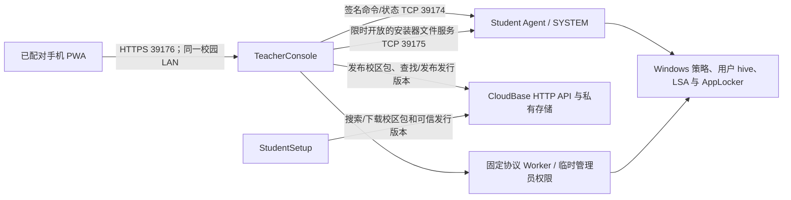

# 架构与实施边界

更新日期：2026-10-07。本文说明系统由哪些组件组成、组件之间如何通信、信任如何建立，以及功能代码与运行验收的边界。项目级 P0–P13 状态以[开发路线与任务清单](开发路线与任务清单.md)为准；专项规格可维护细化子任务，但不改变项目验收结论。详细要求见 [`specs/`](../specs/)。

## 1. 产品范围与当前形态

Veyon Campus 为 Veyon 提供 Windows 校园部署和策略管理工具，不替代 Veyon 的远程查看与控制。当前面向 Windows x64；具体 Windows 版本、更新通道和系统管理状态必须现场核验。项目当前版本为 StudentSetup/TeacherConsole/Worker 0.4.50、Student Agent 0.4.39。

| 组件 | 职责 | 当前生命周期 |
| --- | --- | --- |
| TeacherConsole | 管理本机教师/校区资料；生成校区信任包；签名并推送网站、应用和系统策略；查询逐台状态；处理 Teacher/Student 发行更新；托管手机 LAN 控制服务 | 教师 Windows 桌面进程；手机服务只在教师显式启动时运行 |
| StudentSetup | 搜索/下载 CloudBase 校区包或从本机磁盘导入；执行五步首次部署与管理员维护 | Windows 管理员维护 GUI，保留标准安装/卸载入口 |
| Student Agent | 验证校区签名命令，应用和撤销本工具拥有的策略，返回绑定请求的签名状态/结果；负责受控 Student 更新切换 | 当前以 SYSTEM 计划任务运行；Windows Service 是后续独立迁移目标 |
| Worker | 以短生命周期管理员权限执行 App 不能直接完成的固定本机系统操作；使用受限版本化命名管道协议 | 与 App 版本配套安装；不接受任意脚本、命令或路径 |
| Mobile PWA | 已配对手机读取状态、选择桌面预设、确认并启用/解除策略 | 网页资源随 Teacher 安装包；手机不持有校区签名私钥 |
| CloudBase | 公开前端托管、管理员 API、私有配置包和应用发行物目录/存储、心跳汇总 | Node.js HTTP 函数 `veyon-api` 经网关访问 PostgreSQL/Storage；不是手机策略中继 |
| UpdateHelper | 校验受控安装调用、协调替换/恢复与新版本健康读回 | Windows x64 独立助手；只执行固定发行流程 |

StudentSetup 的五个页面为“配置来源 → 部署内容 → 环境检查 → 执行部署 → 完成”。Student Agent 和 Worker 是不同进程：Agent 长期负责系统策略，Worker 只处理经用户/计划确认的短时管理员操作。

## 2. 组件关系与网络通道

手机只连正在运行的教师控制台，不直连学生 Agent，也不经过 CloudBase 下发操作。教师防火墙中的手机服务和证书引导规则仅允许 `LocalSubnet`；学生更新文件服务也限本地子网并只在推送期间开启。不得将这些端口转发到公网。具体证书引导、配对和撤销步骤见[手机控制使用指南](手机控制使用指南.md)。

| TCP 端口 | 用途 | 身份与范围 |
| --- | --- | --- |
| 39174 | Teacher 与 Student Agent 的状态、策略和更新命令 | 校区签名；Student Agent 在本地子网接受；响应需绑定本次请求并验签 |
| 39175 | Teacher 临时提供 Student 更新安装器 | Teacher 防火墙限本地子网；文件服务按发布版本受限开启 |
| 39176 | TeacherConsole 同源 HTTPS 手机控制界面与 API | 私有 IPv4 监听；配对 bearer 凭据、请求限速和 nonce；教师桌面审批设备 |
| 39177 | 首次安装手机信任所需的公开根证书下载 | 只传根证书；手机须人工比对桌面显示的 SHA-256 指纹 |

## 3. 策略与更新边界

### 网站和应用限制

| 策略 | 当前代码范围 | 关键约束 |
| --- | --- | --- |
| 网站 | Edge、Chrome、Firefox 的机器级域名黑名单、白名单与停用；规则针对根域名及子域名 | 不提供页面路径过滤、便携浏览器覆盖或全机 DNS/网络过滤；Agent 回执不能证明浏览器已经拦截 |
| 应用 | AppLocker 可执行程序规则、教师审核与执行流程、学生账户 SID 范围、审核日志和撤销；长期 EXE 放行规则与课堂 Deny 规则由同一 composer 合并 | Windows Installer/Appx 入口由系统策略单独控制；AppLocker Script/MSI 集合不启用。审核数据不能伪装成启动行为观测；程序实际命中和核心程序兼容需在 Windows 核验 |

网站策略可设置课堂期限，Agent 在到期或撤销后只恢复仍由本工具拥有且未被外部修改的值。外部学校策略与本工具设置冲突时停止覆盖并要求管理员处理。

### 六项长期系统基线

系统策略独立签名、持久保存，不能因课堂网站/应用策略到期而清除。已确认默认值如下：

| 策略 | 默认 | 目标与恢复原则 |
| --- | --- | --- |
| 锁定桌面壁纸 | 开 | 使用 `%WINDIR%\\Web\\Wallpaper\\Windows\\img0.jpg`，禁止学生修改；保存并在撤销时按拥有权恢复原值 |
| 禁止修改系统日期/时间/时区 | 开 | 仅移除目标学生的相关 LSA 权限，保留系统服务权限 |
| 限制网络设置 | 开 | 隐藏/限制网络配置入口，不断开现有网络连接 |
| 禁止安装软件 | 开 | 组合 MSI、Store/Appx 用户范围限制与长期 AppLocker EXE allowlist |
| 禁止管理账户及修改本人密码 | 开 | 学生维持本地标准账户且不具备账户管理/本人改密能力；管理员仍可维护与重置 |
| 限制 Control Panel/Settings | 关 | 默认保持可访问；启用时也保留策略所需维护路径 |

策略写入前检查 Windows 版次、用户 SID、外部策略冲突和允许路径 ACL；跨注册表、离线 hive、LSA 与 AppLocker 的修改按事务记录。完整设计和要求见[学生机系统策略规格](../specs/student-system-policy/requirements.md)及[系统策略设计](../specs/student-system-policy/design.md)。壁纸代码检查格式和尺寸，但未识别 JPEG 像素是否确为蓝色 Windows 徽标且徽标处在画面中间偏右，须由目标 Windows 画面确认。

### 双端更新

Teacher 自更新和 Teacher 到 Student 的更新属于两个版本通道。发行清单包含角色、版本、架构、摘要及策略能力；Developer 签名认证发行物，校区签名认证教师对学生机的更新命令。Student Agent 只在候选版本满足活动应用/系统策略能力门槛时切换，并在新 Agent 健康读回后清理旧文件；失败恢复旧 Agent、任务和状态。教师和学生更新测试包未嵌入生产 Developer Release 公钥，故当前没有可用的在线签名更新。

## 4. 信任材料

| 信任材料 | 用途 | 保管边界 |
| --- | --- | --- |
| Veyon 校区密钥 | Veyon 认证和目标连接 | 教师私钥只在教师侧；配置包含必要的公钥 |
| 网站策略密钥 | 网站策略签名 | 独立用途；不得复用于应用或系统策略 |
| 应用策略密钥 | AppLocker 策略签名 | 独立用途；绑定校区、版本、规则和学生 SID |
| 系统策略密钥 | 六项长期策略签名 | 独立用途；持久版本不随课堂期限重置 |
| Student Agent 身份密钥 | 对 Agent 状态/回执做机器身份认证 | SYSTEM 保护；Teacher 按校区/目标固定公钥并显式批准首次信任或换钥 |
| Developer Release 密钥 | 认证 Teacher/Student 安装器和发布清单 | 生产私钥尚未生成；已选择 GitHub `production-release` protected Environment secret 与离线加密备份 |
| 手机 TLS CA/服务证书 | 认证教师控制台 HTTPS 服务 | 教师 Windows 用户证书库中的不可导出私钥；手机人工核对公开根证书指纹 |

校区课堂操作与 Developer Release 发行认证必须分别验证。CloudBase HTTPS、文件摘要、TCP 成功或 UI 显示绿色状态都不能代替相应签名和设备身份核验。

## 5. 校区包、发行 API 与 CloudBase

Teacher 从 schema v2–v5 生成校区包，StudentSetup 读取 schema v1–v5；云端 Node API、ASP.NET 对照契约、OpenAPI、SQL 约束支持 v3–v5。v4 引入应用策略公钥及五个载荷摘要；v5 增加系统策略公钥、Student Agent 兼容范围及六个载荷摘要。包内不包含教师私钥或课堂策略，课堂操作经校园 LAN 直接推送。

公开发行清单当前使用 schema v3；旧客户端查询签名的 v1/v2 API 仍保留。配置包由 CloudBase 私有对象保存，学生用 API 契约规定的校验值下载；管理员接口经 CloudBase Auth 和 owner/admin 权限保护。学生设备逐台系统状态保存在本机，云端心跳只记录最小化的版本/部署关系，不上传机器名、用户名、浏览历史或屏幕。

截至 2026-10-07，唯一共享体验环境已经先备份，再部署配置包 v5 与 release v2/v3 迁移、`veyon-api` 和 OPA。迁移共 17 条，最新 `20261006120000`；13 项只读 HTTP 检查通过，Teacher/Student 的 v1/v2/v3 latest 均为 HTTP 200 且 `release: null`。schema v3 合成包发布、搜索、下载、撤回及对象清理 E2E 已通过；schema v5 写入 E2E 待本机管理员交互登录后运行。环境快照和检查范围见[CloudBase 验收记录](records/2026-10/体验环境只读验收-20261007.md)，接口与运行方法见[CloudBase API 运行手册](CloudBase%20API运行与验收.md)。共享体验环境不是隔离 staging。

## 6. 当前验证与仍然打开的门槛

2026-10-07 本机 .NET 可移植检查 53/53、Node/API 合同检查 19/19；Student 和 TeacherConsole 角色的后续 Release 构建均为 0 警告/0 错误。最初 TeacherConsole 构建的 XAML loader 警告已通过将只由教师主窗体显式构造的手机控制窗口限定为程序集内部类型消除。网站 production build 成功并触发大 chunk 提示。对应记录包含准确命令和环境，见[实现与检查记录](records/2026-10/续作核查记录-20261007.md)。较早 Windows CI 安装器 smoke 结果不能替代 0.4.50 版本的实机验收。

当前主要门槛：

1. 可恢复 Windows 10/11 设备：安装/卸载、UAC/Worker、实际网站/AppLocker/系统策略命中、目标 SID、外部策略冲突、更新/回滚和重启恢复。
2. Android/iOS 手机与教师 Windows 同网测试：证书信任、配对批准/撤销、策略状态和逐台控制。
3. schema v5 合成线上写入链路：本机 Auth owner/admin 登录、发布/查找/错校验拒绝/下载/验证/撤回/对象清理。
4. 公开发行：权利人决定仓库许可证；核实两个 CloudBase npm 包的许可材料、Veyon 源码义务及 Inno Setup 使用适用性；准备生产 Developer Release 密钥、公钥固定和 CloudBase/Gitee/GitHub 凭据。
5. 核实目标 Windows 默认 `img0.jpg` 的壁纸画面。

任务优先级、每项验收定义和最新完成状态只更新在[任务主表](开发路线与任务清单.md)。

## 7. 相关设计规格

- [网站与云端使用指南](网站与云端指南.md)和[CloudBase API 运行手册](CloudBase%20API运行与验收.md)
- [手机教师控制规格](../specs/mobile-teacher-control/requirements.md)、[手机系统策略控制规格](../specs/mobile-system-policy-control/requirements.md)
- [学生系统策略规格](../specs/student-system-policy/requirements.md)、[CloudBase 更新与安装器规格](../specs/cloud-updates-and-installers/requirements.md)
- [提权 Worker 规格](../specs/p3-worker-uac/requirements.md)
- [文档索引与当前概览](README.md)
