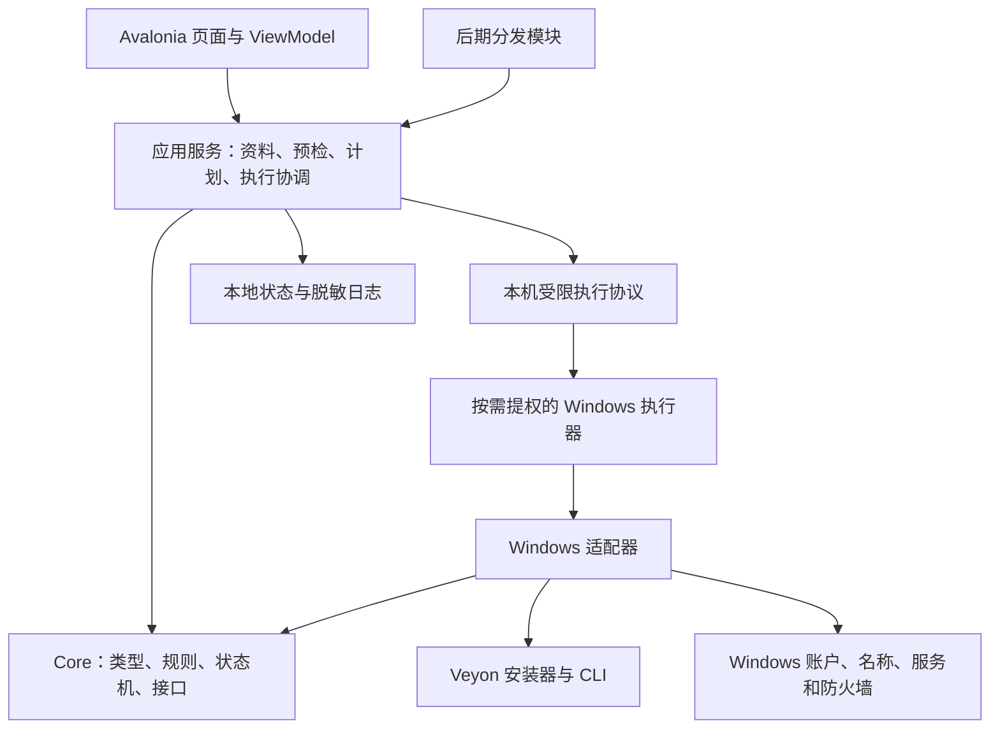
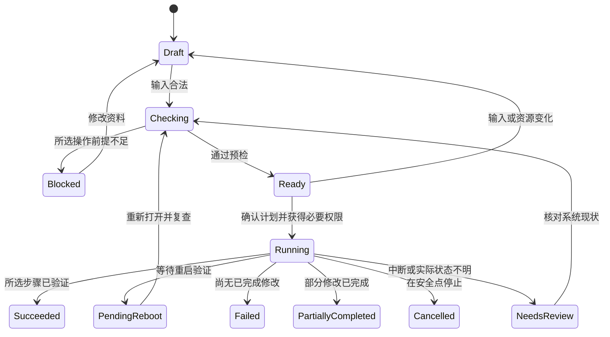

# App 架构与实现约束

更新日期：2026-09-26。当前源码 0.4.5。本文区分当前实现、目标契约与待决策项；任务状态以 [开发任务清单](开发路线与任务清单.md) 为准，0.4.4 复审记录为历史依据。

## 1. 架构目标

### 当前实现与目标门槛

当前已有学生包公钥隔离、预检复核、四项所选操作的执行协调器和本地运行记录；账户操作现通过管理员启动的 App 执行，仍缺受限 Worker、完整备份、崩溃恢复及 Windows 实机验收。以下是持续约束，不能将其中已实现部分和待实现部分一并标为“未修复”或“全部完成”：

- 教师私钥只能保存在独立受控位置；学生包按允许清单导出，不能以文件名含 local-only 代替目录隔离。
- ViewModel 不直接编排系统修改；应用服务消费冻结计划，在受限执行边界再次核对权限、资源来源、摘要和前置条件。执行资源使用受控快照，不能只依赖导入时校验。
- 未实现的任何选中操作必须在首次修改前拒绝；安装失败停止依赖步骤，待重启和部分完成状态单独记录。
- 认证方式、公钥身份与指纹、版本／组件、服务状态分别读回，不互相替代。读回未知或失败不能汇总成整体成功。
- 长任务异步执行、单任务互斥并持久化步骤状态；安装超时不能仅强杀后报告普通失败，应保留需核对状态及恢复依据。
- 新增可替换的进程／系统调用接口用于失败场景检查；当前密码及账户修改只接受明确选择、本地 SID 复核、两次一致的密码和管理员进程，密码不进入命令行／计划／日志。受限 Worker、完整备份、崩溃恢复与实机验收完成前，不将其视为生产可用功能。

让管理员通过本地 App 完成选定操作，避免复制命令；在 Windows 10/11 的已验证组合上，支持每机房 150 台的配置与设备清单；没有互联网也能完成部署。独立操作、可解释的失败和可验证的结果优先于按钮数量少或视觉上“全自动”。

首版不是 Veyon 的替代远控软件，不重写屏幕查看、远程控制或课堂管理协议。部署助手完成任务后可以退出，Veyon 服务负责后续工作。局域网分发后置，远程推送、长期驻留代理和自动发现另行立项。

## 2. 层次与依赖方向

**当前物理结构：** App 引用 Core。MainViewModel 同时管理交互和修改流程；Core 内含规则、资料解析、ExecutionCoordinator、WindowsVeyonAdapter、ProcessRunner、平台探测和内嵌安装器。尚无独立 Application、Windows 或 Worker 项目，现有 Core 只能说不依赖 Avalonia，不能说不依赖 Windows 实现。

**目标调用结构：** 下图为演进方向，不是已经存在的模块清单。



目标的代码依赖方向：Core 定义规则与接口，Windows 层实现接口；Core 不引用 Avalonia 或 Windows 实现。应用启动处负责组合。先提取实际使用的服务／接口，再按权限和测试边界拆项目；不要仅搬动文件却保留 ViewModel 直接编排。

| 模块 | 责任 | 不应承担 |
| --- | --- | --- |
| VeyonCampus.App（现有） | 页面、输入绑定、文件选择／拖放事件、结果展示 | 不在按钮事件中拼命令、改账户、操作注册表 |
| VeyonCampus.Core（现有、需扩展） | 命名、操作模型、计划、状态、可验证规则 | 不弹 UI、不直接运行 PowerShell、不依赖具体 OS |
| Application 服务（先可放 Core 子目录） | 调用预检、冻结计划、协调执行与结果 | 不把“步骤文案”当作可执行协议 |
| VeyonCampus.Windows（待建） | 系统探测、服务／账户适配、Veyon CLI 适配 | 不决定用户应该选择哪些操作 |
| VeyonCampus.Worker（待建） | 高权限边界、受限请求验证、执行与记录 | 不接受任意脚本、任意 EXE 路径或自由命令字符串 |
| 本地状态存储（待建） | 运行记录、备份索引、恢复查询、日志导出 | 不保存可恢复明文密码和无保护私钥 |
| 分发模块（P10 待建） | 提供固定学生包下载、服务生命周期 | 不拥有账户操作接口，不暴露整个项目目录 |

不为了“架构完整”一次创建大量空项目。P1 先建立清晰类型，P2 加平台接口，P3 才建立真实执行器。早期保留一个 App 二进制配合角色上下文；是否拆成两个发布入口在教师包生成时确定，公共逻辑不复制两份。

## 3. 四种独立业务操作

| 操作 | 必要输入 | 不应强制要求 | 需要的结果验证 |
| --- | --- | --- | --- |
| 安装／配置 Veyon | 校区公钥、适配版本、必要安装资源 | 新电脑名、管理员新密码、创建学生账户 | 版本、组件、认证、公钥、服务；网络连接另验 |
| 修改电脑名 | 前缀／目标名称、编号、当前设备 | Veyon、公钥、校区密码文件 | 当前名、待生效名、重启后实际名 |
| 创建普通学生账户 | 明确账户名、初始密码与策略 | Veyon、改名、管理员新密码 | 账户存在、普通权限、启用状态、人工登录 |
| 修改指定管理员密码 | 明确本地账户 SID、新密码 | Veyon、改名、创建学生账户 | 系统调用结果、目标身份、人工登录验收 |

“管理员授权”指执行权限，不代表要修改管理员密码。用户以另一个管理员完成 UAC 时，不得把改密目标悄悄换成提权账户。

当前 `DeploymentPlan` / `ExecutionPlan` 的顺序如下。账户组合已有执行代码，但尚未完成 Windows 实机验收；此处记录当前计划，不宣称它是系统依赖的唯一正确顺序：

```
只读检查（整段前置，第一次真正修改前完成）
  ↓
冻结所选计划
  ↓
创建新学生账户
  ↓
明确选中的管理员改密（当前模型在 Veyon 之前）
  ↓
安装／配置 Veyon（安装和配置分别读回，可能要求重启）
  ↓
改名（待重启生效；不是唯一可能要求重启的步骤）
```

当前没有完整系统备份步骤；公钥快照不等同于账户、注册表或 Veyon 全量备份。改名和安装器的待重启状态会停止后续步骤；App 不会自动重启。

开放真实组合前的取舍（ADR-010）：

- 先完成全部所选操作的检查、授权和必要备份，再发生首次修改；当前尚无完整备份流程。
- 不以未经验证的“本地管理员密码影响 Veyon 服务凭据链”作为账户必须先于 Veyon 的依据。顺序要依据目标环境、服务身份和实际依赖验证。
- 改密旧值不可恢复，建议放在满足依赖后的最后可行位置；该建议与当前模型顺序不同，实施前需同时更新计划、测试与说明。
- 安装器也可能要求重启，不能把改名描述成唯一重启项。失败、需核对或待重启时停止后续修改并保留已完成事实。
- 未选步骤从计划中省略；重复执行的“无需修改”须有已满足后置条件的证据，不能把失败后跳过的步骤视为依赖已完成。

不得用“账户配置”一个勾选框同时创建学生、重置管理员、设为永不过期、开启自动登录。自动登录不是当前需求。

## 4. 建议的数据模型

以下为目标契约。OperationSelection、PackageContext、PreflightReport、DeploymentPlan 和 StepResult 已有同名类型，但字段与职责并不完全等同于此表；DeploymentRun、SecretHandle 等仍待建立。当前冻结执行对象是 ExecutionPlan，不能把下表直接当作可序列化 IPC 协议。

| 类型 | 关键字段 | 约束 |
| --- | --- | --- |
| CampusProfile | CampusId、DisplayName、Rooms | 稳定 ID 与中文显示名分离；显示名不可直接充当文件名或密钥名 |
| RoomProfile | RoomId、Name、Prefix、StartNumber、Count | 数量最多 150；首版编号范围 1–150，Start + Count - 1 不超过 150 |
| MachineSpec | RoomId、Number、HostName、DisplayName、Address | 显示名和连接地址分离；可生成名称不等于全网无冲突 |
| OperationSelection | Veyon、Rename、CreateStudent、ChangeAdminPassword | 四项独立；不能以密码非空推断用户选择改密 |
| PackageContext | Root、Manifest、Campus、KeyFingerprint、ResourceDigests | 读入后保持结构化上下文；不能只在 UI 文案中保存路径 |
| PreflightReport | PlanInputHash、CheckedAt、Checks | 每项包含严重度、实际值、建议；时效到期或输入变化失效 |
| DeploymentPlan | PlanId、Target、Selections、Steps、ResourceHashes | 不可变；用户确认后资源变化必须重检；不含密码 |
| StepResult | StepId、Status、ErrorCode、ExitCode、RebootRequired、Evidence | 业务错误码稳定，中文文案可变；不能只有布尔值 |
| DeploymentRun | RunId、PlanHash、MachineIdentity、AppVersion、Results | 本机受控存储；用于恢复，不能直接信任包内伪造的记录 |
| SecretHandle | 临时凭据引用、生命周期 | 仅内存或受控进程间传递；不序列化进 manifest／日志 |

编号决策：App 预览代码现支持 1–150；旧 PowerShell 脚本仍为 1–99。格式为 `n.ToString("D2")`，所以 3→03、99→99、100→100、150→150。用户尚未要求三位补零，不主动重命名旧的 PC-03 为 PC-003。

前缀最大长度取决于实际数字长度。单台与批量均以最终名称验证；规划到 150 时前缀最多留下 12 个字符的空间。主机名应包含字母，并采用产品允许的 ASCII 字母、数字、连字符规则。教师端与学生端只使用同一个命名服务。

## 5. 部署包协议与兼容

当前交付由完整自包含 App 与轻量配置包组成。布局示意如下，顶层包装目录不是已实现的自动生成器输出；教师当前只生成校区配置包：

```text
OfflineDelivery/
  VeyonCampus/                 完整发布目录（安装器内嵌在 Core DLL）
  Veyon-学生配置包-<校区ID>/
    <校区ID>-public.pem        仅公钥
    website-policy-public.pem  schemaVersion=3 时存在，仅公钥
    campus.json                兼容配置
    manifest.json              schemaVersion=2（旧）或 3（网站策略）
    README.md                  配置包说明
```

未来 manifest 可补充 createdAtUtc、minimumAppVersion、roomId、veyonVersion、keyId 等字段；新增必填项需定义新 schema 与迁移，不静默改变 v2/v3。建议操作可以记录，但凭据和对未知设备执行敏感修改的授权不能记录成无条件默认。

当前代码读取早期 `schemaVersion=1` 部署包，并生成 `schemaVersion=2/3` 校区配置包：v2 清单化 Veyon 公钥；v3 还清单化网站策略公钥；两者的 Veyon 安装器均由 App 内嵌资源提供。清单记录 `packageId`、`targetOs`、`architecture`、`campus`、`computerPrefix` 和公钥文件摘要，但仍缺少通用版本兼容、稳定机房 ID、Veyon 版本及密钥标识等字段，不能默认为受信发行包。当前安装切片另行要求嵌入的 Veyon 4.11.2.0 安装资源匹配 `VeyonInstallerTrust` 中固定的官方摘要，并在 Windows 预检及执行前验证 Authenticode 和发布者证书指纹。此固定基线只支持该单一安装资产，不替代未来正式部署协议及其迁移规则。

读取流程：

1. 先限制文件大小，解析并验证 schema；对高于支持范围的版本显示不兼容，不猜测字段。
2. 验证清单字段类型、重复字段、必填项、编号范围、操作之间的约束。
3. 解析相对路径，拒绝绝对路径、`..`、盘符、包外链接、Windows 重解析点绕过等；验证真正打开的资源。
4. 检查配置包中的公钥大小与摘要；Veyon 安装器从 App 内嵌资源提取并独立校验。摘要只有完整性意义，可信来源另行验证。
5. 记录不可变 PackageContext；手动修改计划不会静默修改源包。
6. 执行前复制必要资源到受控工作目录或锁定可信快照，并再次检查；UI 上次“已校验”不能替代执行器验证。

旧包适配：只读原 campus.json 中的 campus、computerPrefix、keyFile，确认公钥后生成内存上下文；schemaVersion=1 包仍校验其内含安装器，旧版 campus.json 包使用 App 内嵌安装器。保留旧包原文件，不自动创建新密钥、不读取 admin.txt、不静默把旧脚本的账户策略搬进来。

ZIP 导入留作扩展：如果实现，需限制解压总大小、文件数、路径穿越、链接和嵌套包；使用暂存目录，成功后再启用。不能只把 ZIP 改名或直接信任包内启动脚本。

## 6. 只读检查与执行状态机



任务状态与步骤状态分开。某步骤已完成、下一步骤取消，整体要明确显示已经有修改，不能用一个“已取消”遮蔽。图中的 `PendingReboot` 是概念状态，当前代码常量为 `ExecutionPlan.RequiresReboot`（`requires-reboot`），不是另一套协议值。安装返回 3010 当前还会在步骤中留下 `Failed` 加 `RebootRequired=true`，整体再汇总为待重启；应在 P3 统一步骤与整体语义。安装超时当前仍返回普通 Failed，见 AR-02。

建议步骤接口包含：`CheckAsync`、`CaptureBeforeAsync`、`ExecuteAsync`、`VerifyAsync`、可选的 `CompensateAsync`。补偿只在可验证且适合当前状态时调用；不存在通用“一键全回滚”。

2026-09-25 实现进度：Core 已有 `ExecutionCoordinator`，消费冻结计划中的步骤和由应用提供的固定处理函数；按顺序记录结果，失败、部分完成、状态未知或待重启时停止后续步骤，将未开始步骤记为跳过；令牌取消只在步骤边界生效；处理器异常标为需核对，异常消息不进入协调器结果（适配器仍可能返回异常／进程输出，不能据此声称已统一脱敏）。仅学生“安装并配置”接入协调器，应用未传取消令牌；学生单独安装、教师安装与建包仍分别编排。它尚不提供 UAC Worker、跨进程互斥、持久化、备份、通用读回或恢复能力，也不使改名／账户步骤自动变为可执行。

2026-09-26 进度补充：四个共享修改入口接入 `NamedPipeTaskLease`，用当前用户 ACL 的单实例命名管道占位，增加活跃 App 进程之间的互斥。该管道不接收命令，也不具备 Worker 身份／版本验证和高权限执行能力；双进程验收及崩溃恢复仍未完成。

应用服务必须在首个异步等待前取得任务租约，捕获全部输入，并在 finally 中释放；单个 ViewModel 的忙碌布尔值不足以承担跨入口或跨进程互斥。各入口统一经过“冻结请求 → 权限与事实复核 → 受控资源 → 备份／开始记录 → 执行 → 读回／结果记录”，业务细节由固定处理器实现。

每次恢复先重新检查真实系统，而不是只看日志最后一行。尤其是断电发生在系统修改完成和日志写完之间时，重复执行有风险。日志是证据之一，不是事实的唯一来源。

进度按明确步骤或可靠安装器事件展示；不能用计时器从 0% 跑到 100% 冒充安装进度。步骤等待期间保持 UI 可响应，给出可见超时和诊断信息。

## 7. 管理员权限与执行器边界

建议普通 UI 加按需提权的短生命周期 Worker。该方案比整窗一直以管理员运行复杂，但能让拖放、文件浏览和后续下载界面留在普通权限范围。Windows 中普通资源管理器向高权限窗口拖放可能受权限边界限制，因此不应把“始终以管理员启动整个 UI”当作解决部署权限的默认方案。

Worker 的约束：

- 只接受已定义操作和版本化参数，重新验证计划、SID、资源和目标环境。
- 绑定本机当前发起会话与预期进程，拒绝远程连接；短期随机会话标识不能替代操作系统访问控制。
- 命名管道限制 ACL、客户端身份、消息大小、连接数和超时，不允许 Everyone 写入高权限请求。
- 跨账户 UAC 时明确保留发起人和提权人两种身份；不能通过用户名相等替代 SID 核对。
- 请求中不允许任意命令行、任意脚本片段或由下载页面传入的执行路径。
- Worker 失联，UI 显示需核对；不得擅自假定任务已经停止或重新执行。
- 核心版本不安装常驻服务。后期如需常驻代理，重新设计权限、更新、卸载和授权边界。

截至 2026-09-26，当前实现的 `NamedPipeTaskLease` 只占用受当前用户 ACL 保护的单实例管道来互斥，不接收客户端数据。它不满足上面的 Worker 请求协议、安全身份验证或 UAC 边界要求。

Windows 对命名管道使用访问令牌与 DACL 进行访问检查；实现应基于该机制而不是仅靠管道名字难猜。[微软命名管道安全说明](https://learn.microsoft.com/en-us/windows/win32/ipc/named-pipe-security-and-access-rights)

若为内部早期验证临时采用整个 App 提权，必须记录为阶段性决策，禁用无关网络功能，并在正式交付前重新验收拖放和权限边界；不能悄悄把临时方案当作目标架构。

## 8. 外部程序与旧脚本复用

Veyon 官方提供静默安装及配置／密钥／目录相关 CLI，适合作为部署适配层，而非通过模拟鼠标点击安装界面。[安装说明](https://docs.veyon.io/en/latest/admin/installation.html)、[CLI 说明](https://docs.veyon.io/en/latest/admin/cli.html)

资料页面可能落后于固定的 Veyon 4.11.2.0；执行前仍要在目标版本调用帮助并试装。CLI 的 `<KEY>` 形式为仅含字母的名称标识加 `/public` 或 `/private`，不能直接把中文校区名或带连字符的 CampusId 传给 CLI。当前 App 通过 `VeyonAuthKeyId` 对 CampusId 做确定性映射，生成 ASCII 字母 KeyId，并对导入公钥追加 `/public`。教师端后续创建／复用私钥也必须共用此映射；旧脚本按原始 CampusId 命名的密钥需在迁移时显式对应，不能静默视为相同身份。

外部调用统一通过 ProcessRunner：

- 使用明确路径和参数列表，不通过 shell 字符串拼接；中文、空格、引号、特殊字符作为数据处理。
- 同时消费 stdout/stderr，限制体积，避免等待输出导致死锁；日志落盘前脱敏。
- 选择已验证的编码与退出码映射；命令返回成功仍读回状态。
- 安装器、服务启动、CLI 分别定义超时，不共享随意的固定一分钟。
- 凭据不能放在可被进程列表读取的参数里；调用本地账户 API 或使用受控输入通道。
- 临时脚本只有产品自带固定内容，来源由发布流程控制；部署包不得带任意脚本供高权限执行。

旧 teacher/student/add_computer 脚本只作为行为参考：拆除交互、账户绑定、强制重启和路径假设后，才可选择性封装。不要在 App 后台直接执行整段旧学生脚本，因为用户可能只选了 Veyon。

## 9. 数据与凭据保管

教师端与学生端的 Veyon 组件必须按角色安装：学生安装省略 Master 的客户端，教师安装包含 Master。新学生包只带 Veyon 与网站策略公钥；网站签名私钥留在教师当前用户证书库。学生端 SYSTEM 代理校验 RSA-PSS 签名、校区 ID 和递增版本，再写 Edge/Chrome 机器策略。发现既有 URLBlocklist/URLAllowlist 或管理员改动本工具值时拒绝覆盖。学生/教师页面同属一个程序，因此页面切换不是安全边界；隔离由 Veyon 组件角色、Windows 证书访问权限、包内公钥和学生代理 ACL 提供。项目不依赖付费 IAC Add-ons。部署任务代码已接入，但 Windows 计划任务、策略注册表、ACL、防火墙与浏览器生效仍待实机验收，详细流程见[网站访问控制与角色隔离说明](教师端网站访问控制与角色隔离.md)。

| 数据 | 存放建议 | 导出与清理 |
| --- | --- | --- |
| 普通 UI 偏好 | 当前用户本地应用数据目录 | 可以重置，不影响系统配置 |
| 部署运行记录 | 受控本机数据目录，按 RunId 分开 | 导出前预览并脱敏；期限在发布时明确 |
| Veyon 配置备份 | 限制访问的备份目录 | 不混进公共学生包；保留对应版本与摘要 |
| 教师私钥 | Veyon 受控密钥目录 | 仅明确迁移时受保护导出，学生包中绝不出现 |
| 学生公钥和普通配置 | 部署包及受控工作快照 | 可以分发，但仍校验用途和来源 |
| 管理员／学生初始密码 | 短时内存和受控调用边界 | 不写日志、URL、剪贴板、命令行或普通 JSON |
| 下载／安装暂存文件 | 明确工作目录，不依赖 U 盘可写 | 退出后按状态清理，不删除失败恢复所需资料 |

跨机统一密码不是独立操作必然要求。若以后需要携带加密凭据，必须明确“谁持有解锁材料、在哪里输入、丢失如何处理、如何轮换”；把密码和解密密钥一起打包没有解决保密问题。单机加密机制也不能未经验证当作跨机器通用密钥库。

不承诺托管字符串完全清零；尽量缩短凭据生命周期，避免复制、序列化和异常输出。备份旧账户元数据不能恢复旧密码。

## 10. 重复执行和恢复策略

| 操作 | 重复运行 | 失败处理 | 恢复边界 |
| --- | --- | --- | --- |
| 同版 Veyon 安装 | 检查组件与状态后跳过或进入修复计划 | 保存退出码、安装阶段、版本 | 不自动卸载已有正常安装 |
| 公钥导入 | 对比 KeyId 与指纹 | 冲突时停止，不能覆盖教师体系 | 有备份才申请恢复原配置 |
| 新建教师密钥 | 先查已有密钥与部署历史 | 输出目录失败也保留已创建事实 | 不自动删钥后重建 |
| 电脑列表写入 | 按稳定标识／地址检测重复 | 记录新增、修改、未完成项 | 恢复前再次对比当前目录 |
| 电脑改名 | 目标一致则跳过，待重启单列 | 记录当前及待生效名称 | 恢复旧名也可能需重启 |
| 创建学生账户 | 已有同名账户不重建 | 检查真实 SID 与组状态 | 有用户数据时不能自动删除 |
| 管理员改密 | 不盲目重试 | 状态不明时人工核对 | 无法恢复系统中读不到的旧密码 |

补偿动作也可能失败，单独记录。目标是给出可信恢复路径，而不是保证所有系统更改都具备事务回滚能力。

## 11. 150 台、性能与网络的范围

“支持 150 台”分三件事验收：

1. 配置容量：每机房可以生成、校验、导入 150 条唯一设备记录。
2. 部署运作：管理员可分批部署最多 150 台，结果不混淆设备；本地部署仍是每台独立执行。
3. 后期网络负载：下载并发数和 Veyon 同屏监控规模取决于教师机与网络，需要单独实测。

不要从 150 条列表生成成功推导出 150 路远控或 150 个同时下载一定顺畅。UI 大列表采用虚拟化，校验不得阻塞界面；分发采用文件流和有限并发，不为每个请求读完整安装包到内存。

教师与学生需要局域网互通才能连接；本地安装不因此依赖互联网。机房位于不同网段时由现有网络策略决定可达性，App 不修改路由器来强行绕过隔离。

## 12. 局域网分发的后期约束

P9 前不实现监听端口的服务。P10 可在教师端嵌入 Kestrel，由用户明确开启，关闭后释放端口。局域网下载页面仅发布固定包资源，不能与高权限执行器共享任意命令入口。

普通 HTTP 不提供传输保密或对端身份认证。受控试点可以评估使用范围，但正式方案须确定 HTTPS 信任建立或受信发布签名／独立指纹核对机制。App 签名和部署包来源校验分别设计；网页上和文件一起传来的摘要不能单独证明来源。

访问口令／令牌、限时会话和文件摘要各自解决不同问题，不互相代替。未选中结果回传时不采集设备信息；回传接口如实现，需要单独防伪、限流和数据保留策略。

## 13. 发布、版本和可维护性

- App 使用自己的语义版本；原脚本 v1.0 和当前 App 0.4.5 不是同一条版本序列。
- 支持 Windows 的范围要同时满足 App/.NET/Avalonia/Veyon 的已验证组合；仅 Veyon 支持某 OS 不代表整个 App 支持。
- 自包含发布免去目标机另装 .NET，但仍需测试 OS 本身的依赖和兼容性。[.NET 发布说明](https://learn.microsoft.com/en-us/dotnet/core/deploying/)
- 自包含运行库需要随 App 重新发布更新，不能假定机器上的全局 .NET 更新会自动修复包内版本。[微软运行库更新说明](https://devblogs.microsoft.com/dotnet/net-core-updates-coming-to-microsoft-update/)
- 每个发布包记录 Git 提交、SDK、依赖、RID、资源摘要、验证报告和已知问题；维护者可重建，不依赖开发机临时目录。
- 安装器再分发、第三方声明与本项目许可在公开交付前核对实际版本资料；此文不替代具体许可证审核。[Veyon 上游仓库](https://github.com/veyon/veyon)
- 不把日常开发日志、真实部署包、密码或私钥提交仓库；示例使用虚构资料，公钥测试夹具不得伪装成正式部署资源。

## 14. 架构决策记录

| ID | 决策 | 状态 | 理由／复查条件 |
| --- | --- | --- | --- |
| ADR-001 | C# + Avalonia，核心与界面分层 | 用户确定，部分实现 | Windows 执行能力单独适配 |
| ADR-002 | 本地离线功能先完成，分发后置 | 用户确定 | 减少首版网络依赖，便于单机验证 |
| ADR-003 | Windows 10/11，每机房 150 台 | 范围已定；命名规则已实现，系统／规模待实测 | 具体构建号、架构矩阵 P0 确认 |
| ADR-004 | Veyon、改名、创建账户、改管理员密码独立 | 四项选择及组合执行代码已接入；账户和完整组合的 Windows 验收待完成 | 未选操作不产生系统副作用；账户修改须以 SID 和本地组复核 |
| ADR-005 | 最少两位编号，100 起自然三位 | 已实现并有本地检查 | 若需要 001 则先统一迁移规则 |
| ADR-006 | 普通 UI + 按需高权限 Worker | 架构建议，P3 原型验证 | 控制权限并保留普通拖放体验 |
| ADR-007 | 新包不携带 admin.txt，密码默认现场输入 | 架构建议，P6 确认 | 避免把当前明文模式延续到下载包 |
| ADR-008 | 先用 JSON 运行记录与文件备份 | 架构建议 | 数据规模增加或并发查询需要时再评估数据库 |
| ADR-009 | 继续使用 Veyon 安装器与 CLI | 架构建议，版本适配待验证 | 不重写已有安装与课堂控制能力 |
| ADR-010 | 组合真实执行顺序 | 当前模型：账户 → 改密 → Veyon → 改名；最终顺序待 P6 确定 | 删除未证实的凭据链理由；评估改密后置，同时更新计划与测试，不能只改说明 |
| ADR-011 | 完整 App 内嵌固定安装器，v2 配置包仅含公钥和命名 | 已实现；系统交付待验收 | 两份交付物配套分发；新协议不重复附带 EXE |

变更决策时保留旧结论、变更原因、影响任务和迁移办法；不能只更新某个页面文字。
