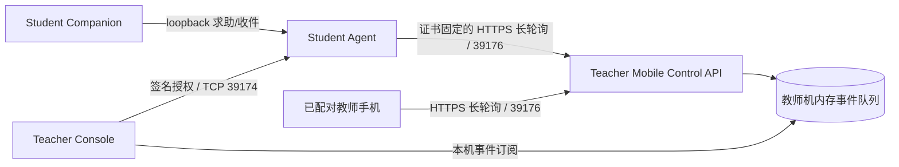

# 双向课堂事件通道：设计

## 数据路径

课堂策略仍只使用现有策略端点。课堂事件拥有独立 purpose、请求格式和队列，不进入策略执行器。

## 组件与协议

- `VeyonCampus.Core` 定义严格 JSON 事件模型、教师签名授权、Agent 本机授权快照、事件 ID/时间窗校验和目标限制。授权寿命固定为两分钟，Teacher 在现有课堂状态刷新周期内续签；课堂结束立即发送撤销授权。
- `WebsitePolicyAgent` 仅增加独立课堂事件端点：接收校区签名授权、检查当前活动 session、保存内存授权，并通过 loopback-only 接口接收 Companion 的求助或提供教师回复。Agent 以自身身份签名、通过固定教师 URL 转发；不执行任何系统策略。
- `TeacherMobileControlService` 在现有 HTTPS 监听器中增加课堂事件 API。移动设备沿用已配对 Bearer token、nonce、防重放和每设备请求上限；学生请求使用 Agent 侧签名材料及教师签发的短期、不透明授权。服务仅接受签名 Agent 已固定到目标的请求。
- Teacher 负责课堂生命周期、目标集合、签名身份 pin、授权续期/撤销，并通过本机事件 hub 把收到的学生事件提供给桌面队列和手机长轮询。活动课堂自动启动服务，下课清除队列并取消等待请求；教师桌面以短轮询读取同一队列。事件 hub 有固定内存上限、最长保留时间和事件 ID 去重。
- 教师手机网页在已有课堂控制页显示当前学生求助并可直接回复；不需要另装手机 App。移动网页用当前 session ID 清理旧课堂内容。
- Student Companion 保持普通用户权限，只通过 Agent 的 loopback 接口提交/读取事件。学生界面只提供一个“请求老师帮助”入口；课堂、设备、原因、地址、证书与重试间隔全部由 Agent/课堂上下文决定，不增加设置项或选择步骤。
- 手机二维码自动选择教师机主用 LAN 地址；课堂事件授权则按每台学生机的实际子网自动选择 Teacher 地址，不显示网卡选择项。
- 求助状态沿同一个 UI 入口闭环：空闲时显示“需要老师帮助”，等待教师期间只显示消息状态，收到对应教师回复后按钮变为“标记已解决”。Companion 通过独立 loopback 路径提交求助 ID；Agent 不接受 Companion 指定事件类型，而是用当前授权和自身固定身份生成 `HelpResolved` 签名事件。
- Teacher 只接受与同一目标的原求助和已存在教师回复相关联的 `HelpResolved`；事件缓冲在保留窗口内读取相关事件以允许回复刚好跨过求助短时有效期，重复解决按原求助 ID 去重。桌面与手机分别显示“等待学生确认”及“已解决”。

## 失败处理与安全边界

- 任何证书指纹不匹配、签名无效、设备身份未固定、session 不活动、重复消息、校区不一致、字段未知或超限，均拒绝事件并记录可诊断的本机结果。
- Teacher 恢复时不恢复事件队列或旧授权；只有活动课堂状态被重新确认后才签发新授权。
- Agent 重启会清空课堂授权；Companion 显示等待状态，Teacher 下一次签名刷新恢复通道。
- 授权令牌只以摘要保存在 Teacher 服务内存；Agent 将实际令牌留在内存状态，并仅通过 loopback 签名响应交给 Companion。
- 学生事件不能指定其他目标或修改课堂/策略状态。Teacher 回复按授权目标重新校验，禁止跨设备投递。
- 事件队列达到固定上限时拒绝新事件并返回明确错误；不落盘、不自动上传、不阻塞教师策略操作。

## 验证策略

以协议级纯 .NET 检查覆盖签名、严格 schema、身份与会话约束、去重、大小/速率和状态生命周期；以 API 集成检查验证移动令牌授权、学生授权、事件提交/订阅和下课撤销；最后执行完整 Release 构建与 Windows x64 两角色发布构建。Windows 上 HTTP.sys/SYSTEM、TLS、Companion 登录会话和真实 LAN 仍需现场验收。
