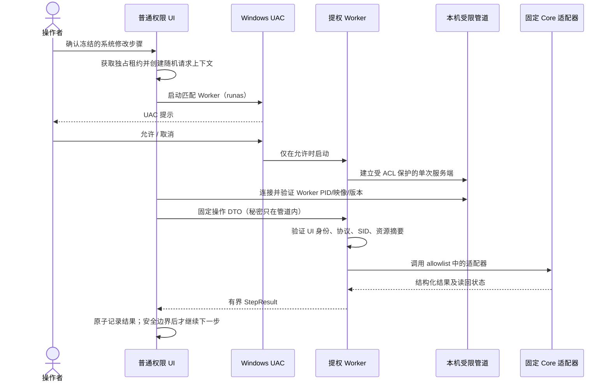

# 设计：短生命周期 Windows Worker

## 组件边界

- `VeyonCampus.App` 改为 `asInvoker`，保留界面、输入冻结、计划确认、任务互斥、日志和 UI 状态。
- 新增 `VeyonCampus.Worker` Windows x64 可执行项目，应用 `requireAdministrator` 清单。Worker 只接收固定版本化 DTO 并调用 Core 中已有的 `WindowsAccountAdapter`、`WindowsRenameAdapter`、`WindowsVeyonAdapter`、`WebsitePolicyAgentInstaller`、`VeyonTeacherKeyProvisioner`、`VeyonTeacherAuthentication` 与 `VeyonNetworkObjectDirectory.AddLocation`。
- Core 增加 IPC DTO、严格 JSON 帧编解码、固定操作枚举和请求边界验证；请求中不表示进程命令行。
- 离线打包、更新暂存和 Inno Setup 将 Worker 与对应 UI 一并安装到管理员拥有的 Program Files 目录；Worker 与 UI 的产品版本必须匹配。

## 提权与 IPC

1. UI 先获取现有独占任务租约、冻结确认过的单一步骤，并生成随机 pipe 名、request ID 和本机身份快照。
2. UI 在自身 SID、Builtin Administrators 和 SYSTEM 的 DACL 下创建一次性 duplex pipe，并启用 Win32 `PIPE_REJECT_REMOTE_CLIENTS`、单实例和首实例标记。
3. UI 以 `UseShellExecute=true`、`Verb=runas` 启动同目录/同版本 Worker；仅传 protocol、随机 pipe 名、UI PID、启动时间、版本和 SID/Session 元数据，不传业务命令或密码。
4. Worker 连接后核对 pipe 服务端 PID，再读取该 UI 进程的实际 SID、会话、映像路径/版本和启动时间。UI 核对 Worker 客户端 PID、映像路径/版本、会话和提升令牌。跨账户 UAC 时，Worker 身份保留为管理员凭据账户；它不会替代 UI 身份或预检绑定的目标账户 SID。
5. Worker 对单个严格 JSON 请求只接受协议版本内的操作枚举和对应强类型参数；重新验证目标、SID、包路径/摘要和环境，再调用固定适配器。密码只经本机管道传输，执行后清除协议缓冲区，不写日志。
6. Worker 返回有界结构化 `StepResult` 后退出。连接关闭、校验失败、UAC 取消、超时或异常均不得自动重试；UI 将不确定的已启动操作记录为需核对并停止计划。

## 安全与恢复

- 使用 OS ACL 与连接两端的 PID、SID、Session、启动时间、映像路径和版本校验；随机 pipe 名仅用于关联，不作为身份认证。
- Worker 只可从管理员控制的安装目录启动；缺少可信目录 ACL、映像身份或版本匹配时拒绝执行。现阶段未有正式 Authenticode 发布证书，安装目录权限校验不能被描述为签名验证。
- Veyon 安装程序先复制到受保护的 Worker 安装树，再重复检查 SHA-256 与 Authenticode，避免直接执行普通用户可替换的缓存文件。
- JSON 使用严格 schema：拒绝重复/未知字段、错误类型、超长字段、无效 SID、超大帧和未知 enum；单请求、单连接、短超时。教师公钥操作只回传验证过的公钥文本与结果状态，不回传私钥、私钥路径或 Veyon 密钥清单。
- Worker 失联后的真实系统状态不确定，按 `NeedsReview` 处理。不得因超时重启 Worker 重放请求。
- Worker 不拥有新计划、不自行推导目标账户、不略过 UI 预检/备份；适配器继续复查易变条件并读回实际状态。

## 验证策略

- 工作区自动检查：DTO strictness、大小/超时边界、未知操作拒绝、请求/SID/版本匹配、结果状态转换和 adapter dispatch allowlist。
- Windows CI：StudentSetup、TeacherConsole 与 Worker 的 Debug/Release 构建、发布目录包含关系、Inno Setup 安装/卸载 smoke。
- Windows 10/11 可恢复 VM：标准账户只读启动、同账户同意 UAC、UAC 取消/输入他人管理员凭据、假/错版本 Worker、错误会话/身份、IPC 过大和远程连接拒绝、Worker 崩溃/超时、跨进程租约、代表性改名/账户/Veyon/Agent 操作及状态读回。
- CI 和静态 fixtures 不能代替 Windows VM 的令牌、DACL、UAC 与恢复验收。
