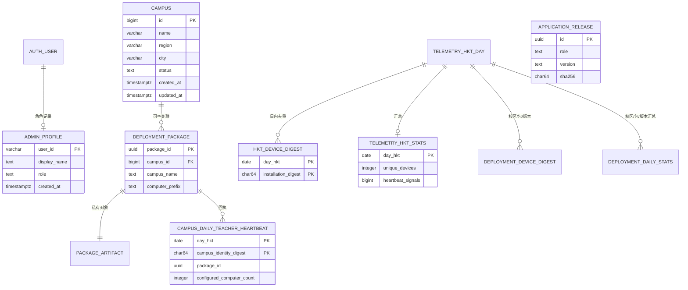

# CloudBase PostgreSQL 数据库设计

记录日期：2026-10-02 
环境：veyon-control，上海 ap-shanghai  
CloudBase 远端迁移已应用至：`20261001110000`，共 13 条迁移、12 张当前应用表。旧 UTC 遥测表、旧教师发布授权表和相关 RPC 已删除；匿名配置包发布和 UTC+8 心跳使用的表与函数仍保留。2026-10-02 只读复核中，`/health`、配置包目录和 TeacherConsole/StudentSetup latest-release 查询均返回 HTTP 200；目录已有记录，两个 latest-release 响应为 `release: null`，尚无已签名应用版本。Teacher 发布的成功路径已有线上记录，但 Student 私有对象下载、撤回清理、Teacher 心跳和 Windows 端到端仍待验收。

本数据库现有结构服务于校区管理、配置包发布与下载、应用版本发布、Teacher 校区心跳和学生端 UTC+8 匿名统计。原始安装标识不会进入数据库。教师可免登录发布校区配置包，数据库不接收原始手机号后四位，只保存 keyed HMAC 指纹；教师姓名保存在仅供服务端访问的列。网站管理员登录与教师发布无关。HTTP 云函数 `veyon-api` 通过 CloudBase HTTP API 访问数据库；桌面 App 不直接连接 PostgreSQL TCP 端口。`veyon-api` 为 ZIP 代码型云函数，运行时 Nodejs20.19、256 MB/60 秒。owner/admin 的管理后台只读 API 对全部 12 张应用表提供分页视图，但设备/校区/发布者 HMAC、地址 HMAC 和私有对象键在服务端遮罩；其他站点角色继续受 RLS 限制。该路由已于 2026-10-02 部署并放行线上 OPA；无令牌请求返回 HTTP 401，确认未登录读取被拒绝。正向 owner 登录及全表读取的浏览器验收仍待完成。业务端到端下载和心跳仍需专用 VM 验收。

## 1. 设计边界

- 身份由 CloudBase Auth 管理；admin_profiles 只保存 Auth 用户 ID、显示名和站点角色。
- 校区资料是站点管理数据，不包含教师、学生或个人账号信息。
- 匿名遥测按 UTC+8 自然日去重。HMAC 摘要按日轮换；部署范围摘要也按 packageId 隔离。
- 心跳发送 manifest `packageId`；服务端用已发布包记录反查校区 ID，不接受客户端自报校区名称或数字 ID。
- 公共网站不使用数据库。浏览器用 publishable key 和登录会话访问 Web RDB API；PostgreSQL RLS 负责授权。
- 服务端 API 使用 CloudBase service API key 调用受限 RPC。该密钥只能放在服务端托管密钥配置中。
- 网站时间戳与遥测日期统一使用 UTC+8（`Asia/Hong_Kong`）；数据库时间戳仍用 `timestamptz` 保存绝对时间点。
- 活跃遥测统一使用 UTC+8 日界线，旧 UTC 逐日表和 RPC 已于迁移 `20261001110000` 清除。部署包范围的逐日 HMAC 不支持跨日或跨包关联。

## 2. 实体关系

AUTH_USER 是 CloudBase 内建认证表，不由应用迁移创建。Teacher 心跳按匿名校区身份和 UTC+8 日期去重；学生端部署分组仅在 package 能关联正式校区时写入。

## 3. 表结构

当前 CloudBase PostgreSQL 有 12 张应用表。迁移 `20261001110000_remove_legacy_telemetry_and_publishers.sql` 清除了已停用的 UTC 遥测表、旧教师发布授权表及相关数据库函数。早期迁移文件仍作为历史记录保留，不表示这些对象当前仍存在。

| 表 | 粒度 | 关键字段 | 索引与用途 |
| --- | --- | --- | --- |
| public.admin_profiles | 每位后台用户一行 | user_id 主键、display_name、role | 角色限定为 owner、admin、editor、viewer；普通浏览器会话仅读本人行，owner/admin 数据页由 API 服务端校验角色后提供全表视图 |
| public.campuses | 每个站点校区一行 | 自增 id、name、region、city、status、创建与更新时间 | 名称和地区长度/非空检查；状态为 active 或 paused；有状态更新时间及地区城市组合索引；更新时间由触发器维护 |
| public.deployment_packages | 每个已发布学生配置包一行 | package_id、校区名、电脑前缀、版本格式、文件大小、SHA-256、状态 | 目录元数据与私有 ZIP 对象分离；匿名学生端只读已发布目录字段 |
| public.deployment_package_artifacts | 每个配置包一行 | package_id、私有对象键 | 原始对象键仅服务端可读；owner/admin 只读 API 显示记录并遮罩对象键 |
| public.deployment_package_download_attempts | 下载失败限速状态 | package_id、地址 HMAC、失败计数与封锁时间 | 不保存原始 IP；owner/admin 可见计数与封锁状态，地址 HMAC 会遮罩 |
| public.application_releases | 每个应用角色/架构/版本一行 | 版本、SHA-256、签名、私有对象键 | 发布清单由 Developer Release 私钥签名；私钥不入库 |
| public.campus_daily_teacher_heartbeats | 每个匿名校区身份每天一行 | package_id、Teacher/Student 版本、配置电脑数、日期摘要 | 原始 Publisher ID 不入库；仅服务端接收成功回执 |
| public.telemetry_daily_hkt_devices | 每日每个安装一行 | UTC+8 日期、安装 HMAC 摘要 | 用于日内去重；原始安装标识不保存，保留 90 天；管理 API 只显示日期与记录时间，摘要会遮罩 |
| public.telemetry_daily_hkt_stats | 每个 UTC+8 日期一行 | 活跃设备数、心跳请求数 | 原子累计，汇总保留 400 天 |
| public.telemetry_hkt_retention_state | 固定维护状态行 | 上次清理日期 | UTC+8 遥测清理任务水位，不是业务数据 |
| public.telemetry_daily_deployment_devices | 日期/校区/配置包/学生端版本的每日记录 | HMAC 摘要及分组键 | 仅包关联正式校区时写入；owner/admin 可分页查看分组字段，摘要会遮罩；保留 90 天 |
| public.telemetry_daily_deployment_stats | 日期/校区/配置包/学生端版本汇总 | 活跃设备数、心跳请求数 | 授权后台按策略读取，汇总保留 400 天 |

### 设计选择

- campuses 当前规模预期以学校/校区资料为主，常规 B-tree 索引足够支持按地区和状态筛选；后台每次最多读取 200 条列表，界面会显示总数。
- 心跳写入通过数据库函数在单个事务中插入逐日摘要并原子更新汇总，避免服务实例各自维护内存计数导致重启或多副本数据不一致。
- unique_devices 是单个 UTC+8 日内去重数。7/30/90 日相加得到的是“每日活跃数之和”，不是周期独立设备总数。
- 每日摘要表和每日统计表有不同保留期，避免把可用于单日去重的摘要长期保存。

## 4. 数据写入与保留

当前 `record_telemetry_heartbeat_v2` 按 UTC+8 日期写入：

1. 服务端以 UTC+8 日期和服务端 HMAC 密钥计算设备摘要。
2. 校验摘要为 64 位大写十六进制字符串。
3. 以 (UTC+8 日期, 摘要) 插入；重复摘要不会重复增加当日活跃安装数。
4. 每次有效请求均增加 heartbeat_signals；新摘要才增加 unique_devices。
5. 当日首次写入时清理超过 90 天的逐日摘要，以及超过 400 天的每日汇总。

应用服务先以服务端 Telemetry__DailyHashKey 对随机安装标识按日期执行 HMAC-SHA256，只将摘要传给该函数。日期密钥与 CloudBase service API key 分开保管。原始标识、摘要、API key 不写入应用日志。

写入 RPC 只允许 service_role 执行；浏览器角色无法读取逐日摘要表。当前后台与统计接口使用 UTC+8 汇总表，不再读取旧 UTC 表。

## 5. 角色和行级安全

| 角色 | 查询自身角色记录 | 读取校区与每日汇总 | 新增/编辑校区 | 删除校区 | 管理站点角色 |
| --- | --- | --- | --- | --- | --- |
| owner | 是 | 是 | 是 | 数据策略允许，当前 UI 未提供删除 | 不允许从浏览器修改 |
| admin | 是 | 是 | 是 | 数据策略允许，当前 UI 未提供删除 | 不允许从浏览器修改 |
| editor | 是 | 是 | 是 | 否 | 否 |
| viewer | 是 | 是 | 否 | 否 | 否 |
| 未登记 Auth 用户 | 无管理资料 | 否 | 否 | 否 | 否 |

所有业务表均启用 RLS。admin_profiles 的 SELECT 策略只返回当前 Auth 身份对应的一行；角色表没有 authenticated 写策略。校区的读写/删除与每日汇总 SELECT 均要求用户在 admin_profiles 中拥有站点角色。遥测明细表和保留状态表对浏览器没有策略与表授权。

当前没有校区级数据隔离。所有已授权站点角色可读取所有校区和汇总统计；角色策略不能替代未来可能需要的校区归属模型。应用页面里的按钮限制只是用户体验，实际安全依赖 PostgreSQL grants 与 RLS。

首次迁移从已有 CloudBase Auth administrator 账号写入一条 owner 角色。该账号 ID 不写进源代码或文档。当前没有公开注册或自助提权流程；后续管理员账号应先在 CloudBase Auth 中创建，再通过受控管理渠道登记最小权限角色。

## 6. 迁移执行记录与后续流程

初始版本文件：

    cloudbase/migrations/20260928141201_create_site_database.sql

CloudBase PostgreSQL 已记录该初始版本，迁移任务状态为 Succeed、verified=true。初始核对结果：五张业务表存在、种子管理员角色为 owner、校区当前 0 行、行级策略已创建。当前没有生产业务资料需要迁移。

后续数据库结构变更必须使用新的 14 位时间版本文件，不得改写已执行的 SQL：

1. 先写前向迁移与受影响表/权限说明。
2. 用 CloudBase PostgreSQL migration plan 检查语法、对象影响与可执行性。
3. 执行前确认计划只涉及预期对象；破坏性 DDL 要另外制定数据备份和回滚方案。
4. 通过 CloudBase migration apply 执行，并等待任务成功。
5. 重新读取表结构、索引、函数、grants、RLS 策略和行数，记录迁移版本及验证结果。
6. 再更新 Web RDB 代码和本文件。

不要直接对业务生产库运行未版本化的 DDL；不要为方便前端访问而开放匿名写权限。

## 7. 容量、备份与后续演进

当前 CloudBase 环境显示为体验版。2026-09-29 只读 SQL 核对得到 PostgreSQL 总大小 10,950,323 字节（`pg_size_pretty` 为 10 MB）；实例模式、连接规格、自动备份/PITR、恢复点和可用性 SLA 仍未完成生产核对。本文没有把体验版额度视为学校生产容量承诺。上线前应在 CloudBase 控制台记录 PG 存储和连接规格、备份保留/恢复演练状态、当前套餐费用与 API 峰值估算。

有迹象显示数据量或并发接近配额时，按以下顺序演进：

1. 观察 PG 存储、慢查询、RPC 延迟和心跳错误率；为服务端写入配置重试上限与限速。
2. 若逐日摘要表增长超出保留窗可接受范围，评估按 day_utc 分区和分区级过期删除。
3. 若管理员列表超 200 条，改为基于 updated_at,id 的游标分页，而非增大单次全表读取。
4. 若要按教师/学生角色或校区做访问隔离，建立校区授权映射并通过 RLS 落实；不能通过 IP 或推测值补关联。
5. 后续可增加有界请求限速、迁移审计与管理员报表导出上限。

上线前应补充并演练数据库恢复流程；备份能力与保留策略目前尚未在本轮环境中验证。

## 8. 教师发布、学生检索的部署包目录

迁移文件：

    cloudbase/migrations/20260929021100_create_deployment_package_catalog.sql

迁移状态：已应用。CloudBase CLI 3.8.4 预览确认只有该迁移待执行，任务 `task-7da92226` 状态为 Succeed；远端迁移历史已核对。只读 SQL 确认三张表均存在且启用了 RLS，发布目录策略、服务端策略、索引、触发器和三个函数均已创建。

迁移包含三个新增表：

| 表 | 粒度 | 访问边界 |
| --- | --- | --- |
| public.deployment_packages | 每个 manifest `packageId` 对应一条不可变发布记录 | anon/authenticated 只能读取已授权目录列；不能写入、撤回或读取私有发布者姓名与身份指纹 |
| public.deployment_package_artifacts | 每个 package 一条私有对象键 | 仅 service_role；不向学生或教师浏览器返回实际存储路径 |
| public.deployment_package_download_attempts | package 与地址摘要的限速状态 | 不保存原始 IP；限制错误下载尝试 |

本结构当前只接受 `schemaVersion=3`、Windows x64 校区配置 ZIP。迁移 `20260930130000_restore_simple_campus_package_publication.sql` 将数据库约束和私有桶对象大小统一为 64 KiB；单个配置文件最多 16 KiB，请求体最多 128 KiB。数据库用清单 package UUID 生成文件名 `veyon-campus-config-v3-<32位小写GUID>.zip` 和私有对象键 `deployment-packages/v3/<32位小写GUID>.zip`。SHA-256 必须是 64 位大写十六进制。文件名、对象键都不由上传者输入。

电脑名前缀在数据库端采用与现有 Windows 命名器一致的 ASCII 字母/数字/连字符规则，最多 12 个字符，确保后续追加 1–150 编号后不超过 Windows 的 15 字符限制；合法前缀可像 `PC-` 一样以连字符结尾。迁移 `20261001090000_align_package_prefix_validation.sql` 已应用。迁移 `20260930120000_require_authenticated_campus_package_publishers.sql` 曾短暂引入教师 Auth 发布要求；后续迁移已恢复免登录 API 发布，并在 `20261001110000` 清除旧授权表和旧授权 RPC。教师提交校区名称、教师姓名和手机号后四位，无需 Auth 账号或预登记校区。已登记校区名唯一匹配 active 记录时自动关联；未登记或重名校区仍以提交的名称发布和搜索。姓名存放在只供服务端读取的列，不进入 student catalog；手机号后四位只保存 keyed HMAC 指纹，用于学生下载校验，不是身份凭据。云端合成包和实际学生下载仍待验收。

学生目录只开放已发布包的名称、校区、前缀、schema、平台、大小、摘要、生成文件名、发布时间和下载计数。对象键表仅服务端可见；下载 API 应重新检查状态与对象存在后再返回短时链接/文件流。包撤回采用软状态，已发布包的校区、前缀、SHA 和大小不可修改；更新配置要生成新的 manifest packageId。

数据库表结构落地不代表业务端到端验收已经完成。Teacher App 免登录发布、ZIP 严格校验、私有 CloudBase 存储及 Student 搜索/下载使用 ZIP 代码型 Nodejs20.19 HTTP 云函数 `veyon-api`；云函数当前 256 MB/60 秒，默认 HTTP API 根路由已建立。迁移最新为 `20261001110000`；2026-10-02 只读复核中，健康检查、配置包目录和 TeacherConsole/StudentSetup latest-release 查询均返回 HTTP 200，latest-release 当前均为 `release: null`。Release 清单与 Teacher heartbeat schema 已部署，教师端首次成功发布配置包后会延迟 60 分钟发送心跳；Student 私有对象下载/校验/撤回清理、Teacher 心跳回执和管理员浏览器 RLS 仍需专用 VM/浏览器环境做端到端验收。当前工作区移除 Windows 文件共享配置分发入口；本机磁盘导入保留为离线维护方式。

## 9. UTC+8 校区和版本遥测（迁移已应用）

迁移文件：

    cloudbase/migrations/20260929140000_add_daily_campus_version_telemetry.sql

目标结构包含：

| 表 | 粒度 | 权限 |
| --- | --- | --- |
| telemetry_daily_hkt_devices | UTC+8 日期、每日全站安装 HMAC 摘要 | 仅服务端 |
| telemetry_daily_hkt_stats | UTC+8 日期的全站活跃数与请求数 | service_role 写；已登记站点角色按 RLS 读 |
| telemetry_daily_deployment_devices | UTC+8 日期、校区、deployment packageId、StudentSetup 版本、每日 HMAC 摘要 | 仅服务端 |
| telemetry_daily_deployment_stats | UTC+8 日期、校区、deployment packageId、StudentSetup 版本的每日活跃数与请求数 | service_role 写；已登记站点角色按 RLS 读 |

迁移 `20260929140000` 新增 UTC+8 全站统计和部署包/校区细项；旧 UTC 表和旧 RPC 曾为兼容而保留，后由 `20261001110000` 删除。当前 API 只写入 `record_telemetry_heartbeat_v2` 与校区/版本细项。Teacher 心跳独立写入 `campus_daily_teacher_heartbeats`，不记录学生姓名；首次发布部署包后 60 分钟才发起第一次 Teacher 心跳。

RPC 原子写入全站每日汇总，并从 `deployment_packages.package_id` 反查 `campus_id`。已发布或已撤回的包编号都保留其历史校区映射；未知包编号只进入全站汇总，不会生成校区归属行。全站与部署范围摘要分开 HMAC，避免在同一天通过摘要跨包关联安装。

新 `record_telemetry_heartbeat_v2` 的全站 `unique_devices` 按 UTC+8 日期去重；校区细项按日期、校区、packageId 和版本去重。重复 API 请求只会增加对应 `heartbeat_signals`，不会虚增该分组活跃数。一个设备若在同一天使用不同版本或配置包，会在对应分组分别计数，因此分组相加不是校区总安装数。

## 10. PostgreSQL 当前体量与用量核对（2026-09-30）

数据库体量、表结构和行数来自此前成功的 CloudBase 只读查询；2026-09-30 另通过控制台只读复核资源账单与运行状态，没有执行数据库写入。下表为 2026-09-30 历史快照：

| 项 | 核对结果 | 解释 |
| --- | --- | --- |
| 数据库总大小 | 10,950,323 字节；`pg_size_pretty` 显示 10 MB | 包含 PostgreSQL 与 CloudBase 系统 schema 的基础占用 |
| 校区、部署包数据 | 当时 `campuses` 与 `deployment_packages` 为 0 行 | 这是 2026-09-30 历史值，不代表当前行数 |
| 部署包对象 | `storage.objects` 当前 0 行；桶 `deployment-package-artifacts` 存在且 `public=false` | 文件暂未上传，桶为私有 |
| 业务表大小 | 当前最大用户表 `auth.users` 约 208 KiB；应用表多为数十 KiB | 没有明显可清理的大表或索引 |
| API 连通性 | 当时 CloudBase `veyon-api` HTTP 函数 Active；`GET /health` 为 HTTP 200；目录返回空结果；免登录发布 RPC ACL 经只读查询核对 | Teacher 发布、对象存储读写、Student 下载和 heartbeat 尚未做合成数据端到端验收 |

CloudBase 控制台当前账期为 `2026-09-28` 至 `2026-10-28`。PostgreSQL 显示容量使用量 316 MB·小时、CU 使用量 820 核秒、消耗 78.28 点；820 核秒按 342 点／核小时约为 77.9 点，316 MB·小时按 0.5 点／GB·小时约为 0.15 点，账单主要来自数据库计算区间。MB·小时是容量乘以时间的累计值，不是当前有 316 MB 数据；数据库实际大小仍约 10.95 MB。云托管类别另累计 355.69 点、2.98 核小时和 5.97 GB·小时内存，但当前控制台服务列表为 0 个服务；明细没有按服务名拆分，不能据此断定具体来源。整体体验版额度 3,000 点已用 434.82 点。用量汇总未按 SQL 或调用者归因，不能仅凭这些总量判断某次查询造成了多少消耗。

上述用量数据是 2026-09-30 的历史快照。2026-10-01 按用户要求删除了四张确认废弃的空旧表/维护表；此整理主要减少旧协议和旧代码路径，数据库体量节省有限。保留的 UTC+8、校区/版本统计、发布及管理员表仍由当前 API 或网站使用，不应仅为减少表数而合并或删除。

## 11. 2026-10-02 只读数据快照

本节为 2026-10-02 CloudBase PostgreSQL 只读 `count(*)` 和 HTTP GET 结果；未读取发布者资料、对象键或其他个人/敏感字段，也未执行云端写入。

| 表 | 行数 | 表 | 行数 |
| --- | ---: | --- | ---: |
| `admin_profiles` | 1 | `application_releases` | 0 |
| `campus_daily_teacher_heartbeats` | 2 | `campuses` | 0 |
| `deployment_package_artifacts` | 4 | `deployment_package_download_attempts` | 2 |
| `deployment_packages` | 4 | `telemetry_daily_deployment_devices` | 0 |
| `telemetry_daily_deployment_stats` | 0 | `telemetry_daily_hkt_devices` | 2 |
| `telemetry_daily_hkt_stats` | 1 | `telemetry_hkt_retention_state` | 1 |

| 核对项 | 结果 |
| --- | --- |
| 配置包存储 | 私有 bucket 有 3 个对象；不公开对象键 |
| 应用安装器存储 | 私有 bucket 已存在、当前 0 个对象 |
| `GET /health` | HTTP 200，ready |
| `GET /v1/deployment-packages?limit=1` | HTTP 200；返回一条可见目录结果 |
| TeacherConsole / StudentSetup latest-release GET | HTTP 200；均为 `release: null`，还没有签名版本 |

这些行数仅描述本次只读快照，不能代替实际教师发布、学生下载/校验/撤回清理、心跳上报或管理员 RLS 浏览器验收。
